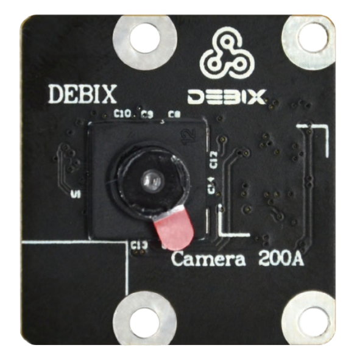
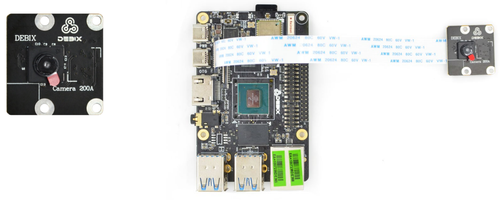
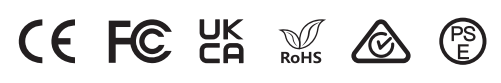
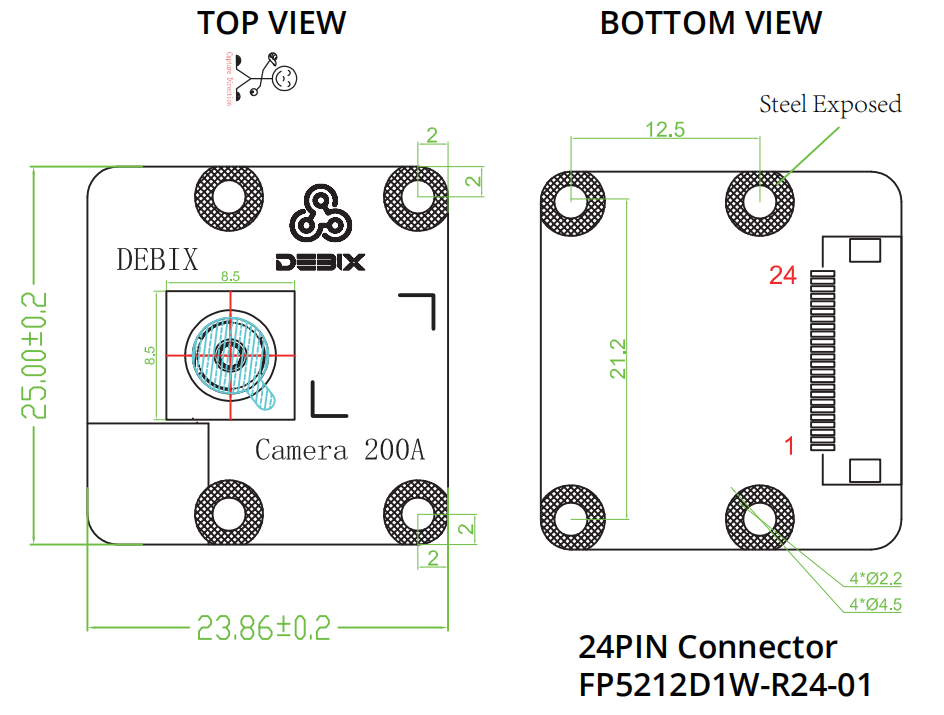

# DEBIX Camera 200A Module
 

## Overview
DEBIX Camera 200A Module is a tiny camera with the GC2145 sensor. It supports recording 1600 x 1200 video at 20fps, and features high still resolution of 2 megapixels and a diagonal field of view of 76 degrees. Camera 200A includes a 15cm flexible flat cable to connect with the CSI input connector on DEBIX SBCs.

## Main Features:
- 2 megapixels still resolution, 1600 x 1200/20fps video mode
- 76 degrees diagonal FOV, 60 degrees horizontal FOV, 50 degrees vertical FOV
- Fixed focus

## Compatibility:
- Compatible with DEBIX Model A, DEBIX Model B, DEBIX Model C, DEBIX Infinity and DEBIX R3576-01
- Support for use with DEBIX SOM A I/O Board through an add-on board

## Specification
| Camera 200A     |                              |
|:----------------|------------------------------|
| Still Resolution| 2 megapixels                 |
| Video Mode      | 1600 x 1200/20fps            |
| Sensor          | GC2145                       |
| Sensor Resolution | 1616 x 1232 pixels         |
| Sensor Image Area | 2.83mm x 2.16mm           |
| Pixel Size      | 1.75μm x 1.75μm              |
| Optical Size    | 1/5"                         |
| Depth of Field  | Approx 30cm to ∞             |
| Diagonal FOV    | 76 degrees                   |
| Horizontal FOV  | 60 degrees                   |
| Vertical FOV    | 50 degrees                   |
| Focus           | Fixed                        |
| Focal Length    | 2.27mm                       |
| Focal Ratio (F-Stop)  | 2.2                    |
| Maximum Exposure Time (seconds)  | /           |
| Lens Mount      | N/A                          |
| Size            | 25mm x 24mm x 8.85mm         |
| Gross Weight    | 13g                          |
| Flexible Flat Cable  | 15cm                    |
 
| Camera Lens     |                              |
|:-----------------|------------------------------|
| Output Formats  | Raw/YCbCr4:2:2/RGB565        |
| Lens Construction | 3P+1IR                     |
| TV Distortion    | <1.5%                       |
| Thread          | M5 x 0.35P                   |
| IR Filter       | 650±10nm                     |
| S/N Ratio       | TBD                          |
| Dynamic Range   | TBD                          |
| Power Supply    | Core: 1.8VDC Analog: 2.8VDC I/O: 3.3VDC   |
| Power Consumption | Operating: 100mW           |
| Temperature Range | Operating Temp.: -30℃\~70℃ Storage Temp.: -40℃\~85℃ |

## Certificates

## Mechanical Dimension:

## Pin Definition: (24-Pin Description)

|Pin| Definition          |
|---|---------------------|
| 1 | VDD_5V              |
| 2 | VDD_3V3             |
| 3 | VDD_1V8             |
| 4 | CSI-PWD             |
| 5 | CSI-NRST            |
| 6 | CSI-I2C-SDA         |
| 7 | CSI-I2C-SCL         |
| 8 | CSI-SYNC            |
| 9 | CSI-MCLK            |
| 10 | GND                |
| 11 | CSI-DN0            |
| 12 | CSI-DP0            |
| 13 | GND                |
| 14 | CSI-DN1            |
| 15 | CSI-DP1            |
| 16 | GND                |
| 17 | CSI-CKN            |
| 18 | CSI-CKP            |
| 19 | GND                |
| 20 | *CSI-DN2(NC)*        |
| 21 | *CSI-DP2(NC)*        |
| 22 | GND                |
| 23 | *CSI-DN3(NC)*        |
| 24 | *CSI-DP3(NC)*        |

## Contact Us
- **Headquarters**: DEBIX Technology Inc., 8345 Gold River Ct., Las Vegas, NV 89113, USA  
- **Factory**: 5-6/F., East Zone, Shunheda A2 Building, Liqxiandong Industrial Park, XiLi, Nanshan Dist., Shenzhen, China  
- **Email**: info@debix.io  
- **Website**: [www.debix.io](https://www.debix.io)  
- **Community**: [Discord](https://discord.com/invite/adaHHaDkH2)